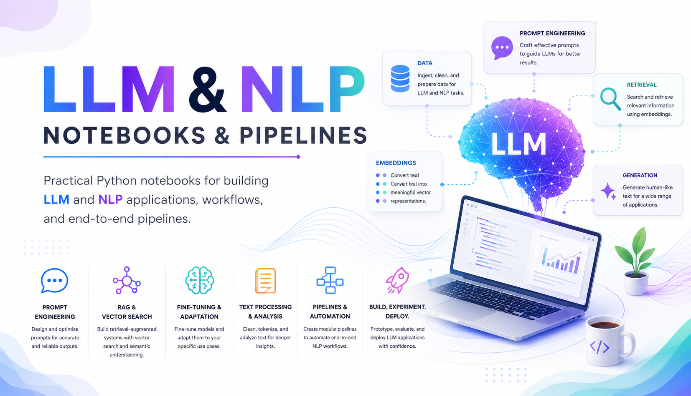

<p align="center">
  <a href="#" target="_blank">
    
  </a>
</p>

# LLM-NLP-py

A collection of Python notebooks showcasing practical Large Language Model (LLM) and Natural Language Processing (NLP) applications, workflows, and end-to-end pipelines.

## Description

This repository contains a curated collection of Python notebooks focused on Large Language Models (LLMs) and Natural Language Processing (NLP) applications. It includes practical implementations of text preprocessing, prompt engineering, transformer-based models, retrieval-augmented generation (RAG), fine-tuning workflows, and AI automation pipelines. The project is designed for learning, experimentation, and rapid prototyping of modern NLP and generative AI solutions using popular Python libraries and frameworks. These notebooks aim to provide clear, hands-on examples for building scalable and production-ready LLM-powered applications.

## Usage

Navigate to the `source/` directory and open any `.ipynb` file in Jupyter. Run the cells in order to execute the demonstrations.

## Requirements

- Python 3.8+
- Jupyter Notebook
- API keys for respective services

## Environment Variables

Create a `.env` file in the root directory:

```
OPENAI_API_KEY=sk-proj-your-api-key-here  # Connect to OpenAI models for LLM operations
```

## Files

| Name                          | Description                                                                                                                                             | Tags                      |
| ----------------------------- | ------------------------------------------------------------------------------------------------------------------------------------------------------- | ------------------------- |
| [RAG.ipynb](source/RAG.ipynb) | Retrieval-Augmented Generation application for PDF documents using semantic search and re-ranking to retrieve context for LLM-based question answering. | RAG, LLM, Semantic Search |

## License

MIT License

## Contributing

Contributions are welcome! Please feel free to submit issues, feature requests, or pull requests.
